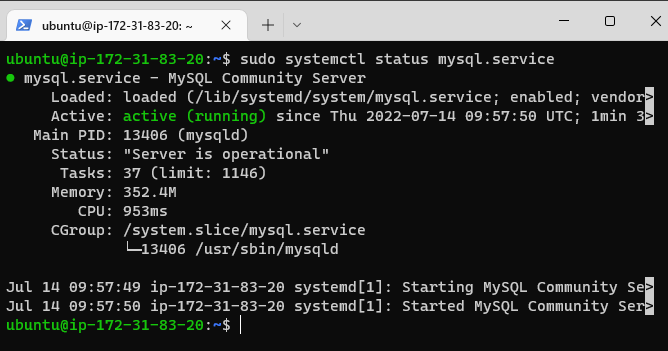
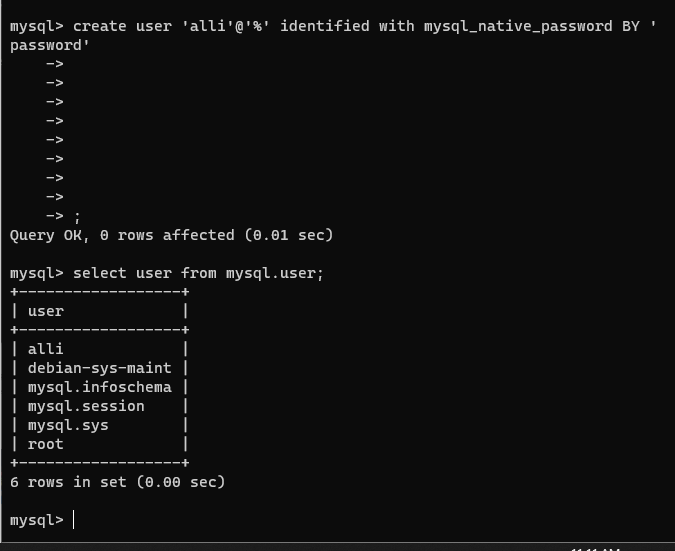
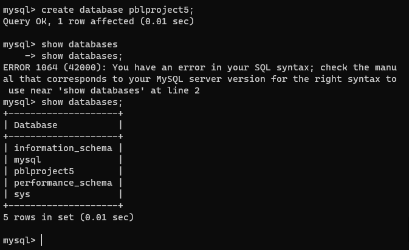
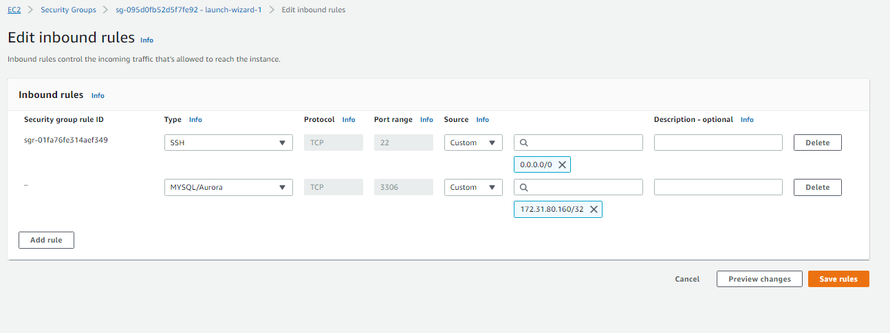
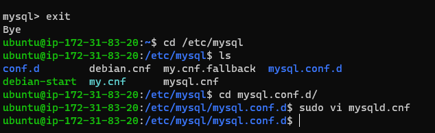
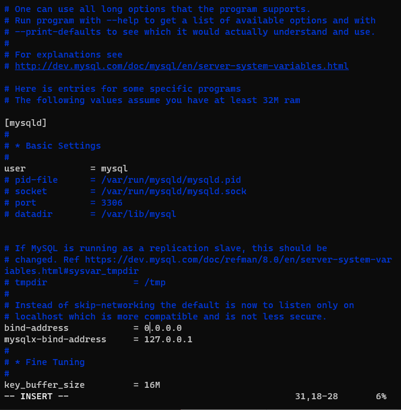
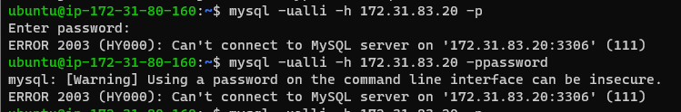
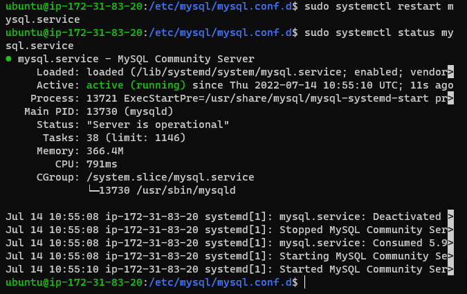
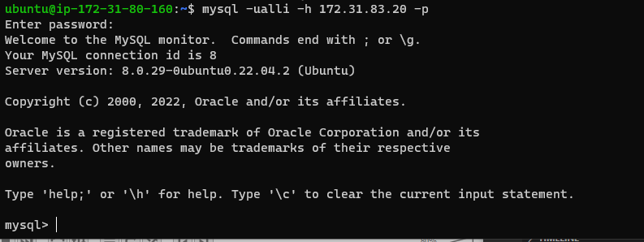
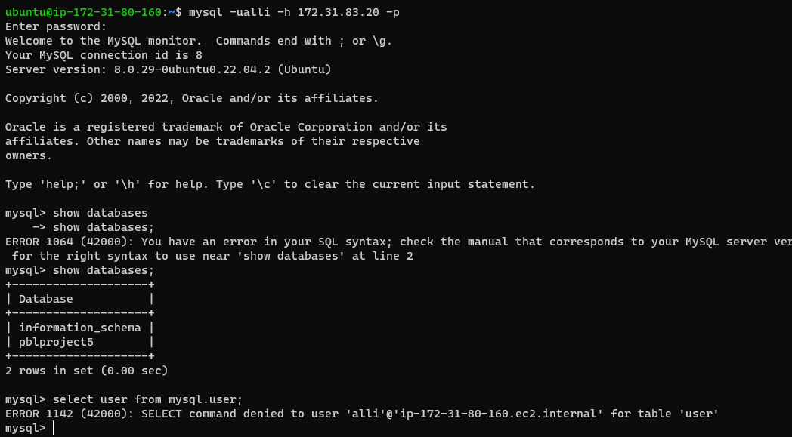

# Project 5

I started by creating the two ubuntu servers to be used for this project. One as a SERVER and the other as a CLIENT

``Server A name - mysql server``

``Server B name - mysql client``

**Ran the following commands to install the required on the server and install the mysql server**

`sudo apt update`

`sudo apt upgrade`

`sudo apt install mysql-server`

**confirmed mysql server running**

`sudo systemctl status mysql.service`

did `sudo mysql` and next created user ***alli** with password ***password***

`create user 'alli'@'%' identified with mysql_native_password BY 'password`

**Then, created the database ***pblproject5*****

**granted user ***alli*** access to the created database**

`GRANT ALL ON pblproject5.* TO 'alli'@'%';`

Next, edited inbound rule for mysql server

MySQL server uses TCP port 3306 by default, so I edited inbound rule to allow traffic from only the client server with the IP in the image below:

Then, I edited the bind-address in the ***mysql.conf.d*** file on the mysql server with the commands and images as follow

`cd /etc/mysql`

`cd mysql.conf.d`

Then, change the IP address with `sudo vi mysqld.cnf` as this can only be completed by the root user

After completing all these on the mysql server, I opened and connected from another terminal to the client server and istalled ***mysql-client***, did ***sudo apt update*** and ***sudo apt upgrade*** using the commands below

`sudo apt update`

`sudo apt upgrade`

`sudo apt install mysql-client`

Then, attempted login to the mysql-server with the command 

`mysql -ualli -h 172.31.83.20 -p`

Experienced a few errors trying to connect to the mysql server from the client. 

However, this was resolved by restarting the mysql server with the command

`sudo systemctl restart mysql.service`

then, I confirmed the status running with the command

 `sudo systemctl status mysql.service`

 

***project 5 completed succesfully***
<<<<<<< HEAD

next
=======
>>>>>>> fad32678b8c4ecad80424249fad71ebbf14fd77e
